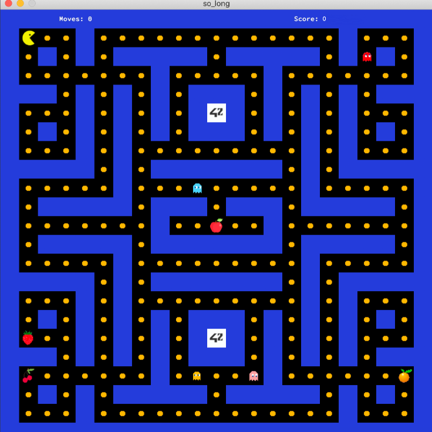
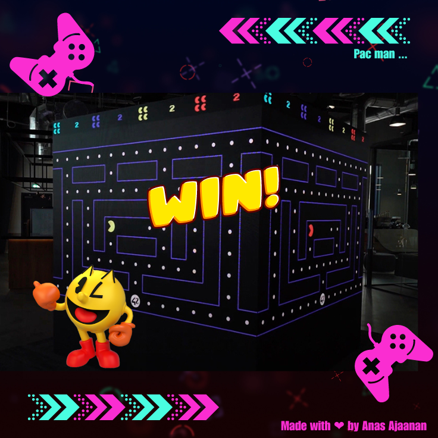
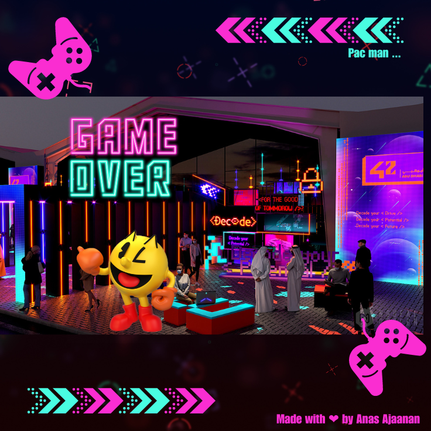

# Pac Man (So Long)

## **Table of Contents**

- **[Introduction](#introduction)**
- **[Description](#description)**
- **[Game Rules](#game-rules)**
- **[Bonus Features](#bonus-features)**
- **[Installation](#installation)**
- **[Usage](#usage)**
- **[Project Structure](#project-structure)**
- **[Mandatory](#mandatory)**
- **[Bonus](#bonus)**
- **[Controls](#controls)**
- **[Contributing](#contributing)**

## **Introduction**

The So_Long project is part of the 42 School curriculum and is designed to introduce students to graphical programming and game development using the MiniLibX library. The goal of this project is to create a 2D game with a simple graphical user interface and basic gameplay mechanics.

In this specific implementation, we have chosen to create a game inspired by the classic arcade game "PacMan." The player controls PacMan, a character that moves around a maze, eating collectibles (dots) while being pursued by ghost enemies. The objective is to clear all the collectibles in the maze without getting caught by the ghosts.









## **Description**

The PacMan game is a classic arcade game developed in the early 1980s. It became one of the most iconic and influential games in the history of video gaming. The game features a simple and addictive gameplay loop, making it enjoyable for players of all ages.

## **Game Rules**

The objective of PacMan is to navigate through the maze and eat all the dots (collectibles) while avoiding the ghosts. The game has the following rules:

- PacMan can move in four directions: up, down, left, and right.
- The ghosts move autonomously and will chase PacMan through the maze.
- If PacMan collides with a ghost, the player loses one life, and the game continues.
- Once all the dots are cleared from the maze, the player wins the game.
- The game has multiple levels, each with a different maze layout and faster ghosts.

## **Bonus Features**

The bonus version of the PacMan game includes the following additional features:

1. Four Ghost Entities: Each ghost has unique behaviors, making the game more challenging and engaging.
2. Extra Power-Up Fruits: Special fruits that enhance PacMan's abilities and provide unique gameplay advantages.


## **Installation**

1. Clone the repository to your local machine:
    
    ```bash
    git clone https://github.com/anassajaanan/PacMan-Game-.git
    ```
    
2. Build the project using the Makefile provided:
    
    ```bash
    cd PacMan-Game-
    ```
	```bash
    cd mandatory
	```
	```bash
	make
    ```

## **Usage**

To start the game, run the following command in the terminal:

- Run the game with one of the bonus maps (level1.ber, level2.ber, level3.ber, etc.):


```bash
./so_long maps/[map_file].ber
```

If you want to play the bonus version of the game, follow these steps:

1. Change to the "bonus" directory:
    
    ```bash
    cd bonus
    ```
    
2. Build the bonus version of the project using the provided Makefile:
    
    ```bash
    make
    ```
    
3. Run the game with one of the bonus maps (level1.ber, level2.ber, level3.ber, etc.):
## **Project Structure**

The project is divided into two directories: "mandatory" and "bonus." The "mandatory" directory contains the core implementation of the PacMan game, fulfilling the minimum requirements for the project. The "bonus" directory includes additional features or improvements on top of the mandatory part.

### **Mandatory**

- **Makefile**: Contains rules for compiling the project and generating executable files.
- **depth_first_search.c**: Implements the depth-first search algorithm to check valid paths.
- **depth_first_search_utils.c**: Provides utility functions to support the depth-first search algorithm.
- **ft_printf**: Custom implementation of the printf function.
- **get_next_line**: Custom implementation of the get_next_line function.
- **images.c**: Loads and manages images required for the game (textures).
- **libft**: Custom library with various utility functions.
- **line_queue.c**: Implements a queue data structure to handle map lines.
- **map.c**: Parses and validates the PacMan map from a text file.
- **map_validator.c**: Checks the validity of the PacMan map according to specific rules.
- **maps**: Directory containing sample PacMan maps in text format.
- **mlx**: MiniLibX library for graphical interface.
- **mouvements.c**: Handles player movements.
- **parsing.c**: Handles command-line arguments and map parsing.
- **player.c**: Implements the player's movements and interactions.
- **so_long.c**: Main entry point for the PacMan game.
- **so_long.h**: Header file containing function prototypes and structures.
- **textures**: Directory containing texture images for the game.

### **Bonus**

The "bonus" directory is an extension of the "mandatory" part and contains additional features or improvements, such as optimization, extra levels, enhanced graphics, and more exciting gameplay.

- **depth_first_search_bonus.c**: Bonus depth-first search algorithm to check valid paths.
- **depth_first_search_utils_bonus.c**: Bonus utility functions to support the depth-first search algorithm.
- **fruits_bonus.c**: Additional power-up items (fruits) that enhance the player's abilities.
- **game_utils_bonus.c**: Bonus utility functions to support the game mechanics.
- **ghost_movement_bonus.c**: Improved ghost movements and interactions.
- **ghost_movement_utils_bonus.c**: Utility functions for the ghost movement algorithms.
- **ghosts_bonus.c**: Implementations of ghost entities with unique behaviors.
- **image_utils_bonus.c**: Additional utility functions to manage images and textures.
- **images_bonus.c**: Additional texture images for bonus features.
- **line_queue_bonus.c**: Additional queue data structure for specific purposes.
- **map_bonus.c**: Bonus functionalities related to map parsing and validation.
- **map_validator_bonus.c**: Bonus map validation rules and checks.
- **map_validator_helpers_bonus.c**: Additional helper functions for map validation.
- **maps**: Directory containing bonus PacMan maps with challenging layouts.
- **mlb**: Custom MiniLibX library for the bonus part.
- **mouvements_bonus.c**: Enhanced player movements and interactions.
- **parsing_bonus.c**: Extended command-line arguments handling and map parsing.
- **player_bonus.c**: Bonus features for the player entity.
- **so_long_bonus.c**: Main entry point for the bonus version of the PacMan game.
- **so_long_bonus.h**: Header file containing function prototypes and structures for bonus features.
- **textures**: Additional texture images for bonus features.

## **Controls**

- Use the arrow keys (up, down, left, right) to control PacMan's movements.
- Press "ESC" or close the game window to exit the game.

## **Contributing**

Contributions to this project are welcome. If you find any bugs, have suggestions for improvements, or want to add new features, feel free to submit a pull request on GitHub.